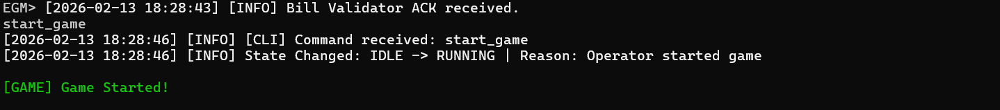
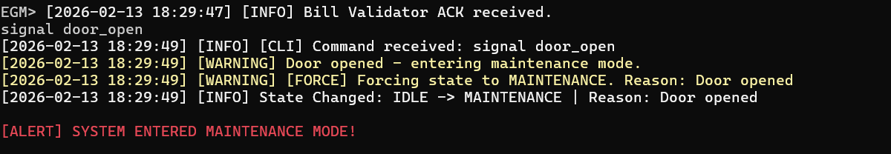
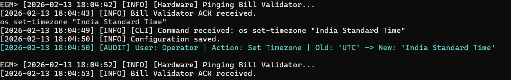
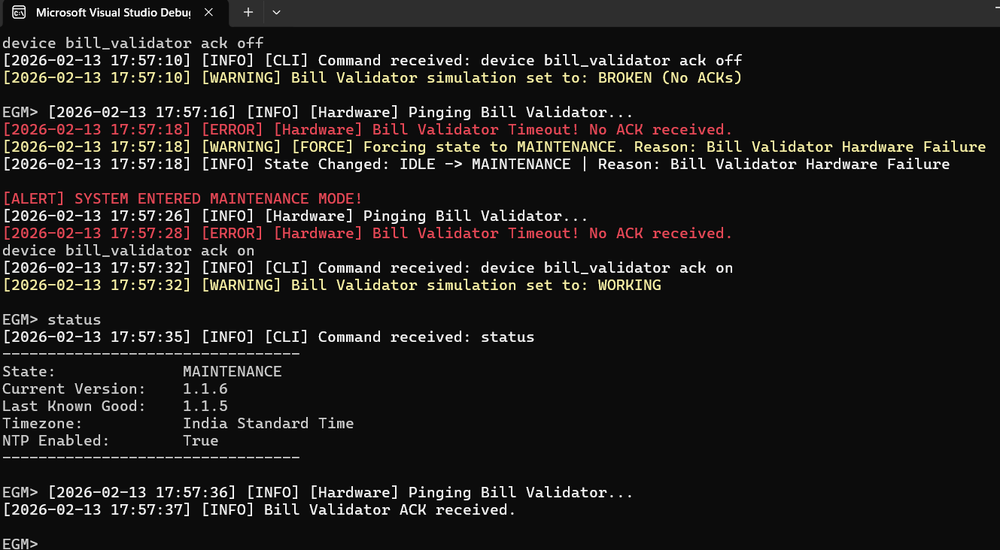
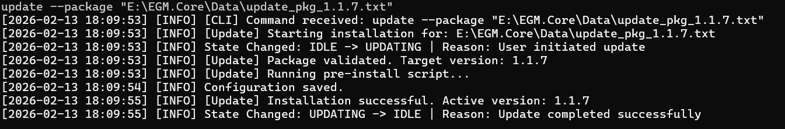
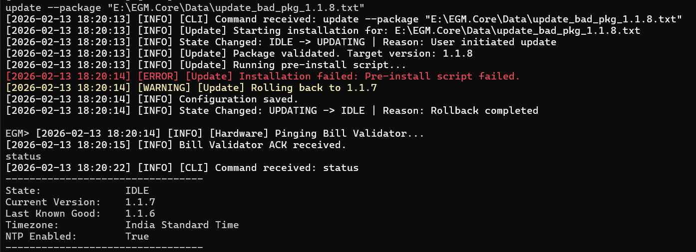

# EGM Core Module Template

This project is a logic-only C# console application that simulates the core control module of an Electronic Gaming Machine (EGM). It demonstrates robust state management, hardware simulation, transactional updates with rollback, and audit logging.

## Prerequisites

* **OS**: Windows, Linux, or macOS.
* **.NET SDK**: Version 6.0 or later (Developed with .NET 8.0).
* **IDE (Optional)**: Visual Studio 2022 or VS Code.

## Project Structure

* `EGM.Core/`: Main application source code.
* `EGM.Core.Tests/`: Unit tests using xUnit and Moq.
* `Logs/`: Automatically generated folder storing logs, configuration, and install history.

## How to Run

1.  **Open a terminal** in the solution root folder.
2.  **Build the project**:
    ```bash
    dotnet build
    ```
3.  **Run the application**:
    ```bash
    dotnet run
    ```
4.  You will see the `EGM>` prompt indicating the CLI is ready.

---

## 5-Step Demonstration Sequence 

To verify the 5 required behaviors (Game Update, Door Open, Bill Validator, OS Settings, and State Machine), follow this exact command sequence.

### **Preparation**
Before running the update commands, you must create dummy update package files because the system validates file existence.
1.  Navigate to the `Logs` folder inside the project (e.g., `E:\EGM.Core\Logs`).
2.  Create an empty text file named: `update_pkg_2.0.0.txt`
3.  Create another empty text file named: `update_pkg_bad_3.0.0.txt`

### **Step 1: State Machine & Logging (Behavior #5)**
Test standard state transitions and verify logging output.

```text
EGM> status

Output:
 ---------------------------------
State:              IDLE
Current Version:    1.1.6
Last Known Good:    1.1.5
Timezone:           UTC
NTP Enabled:        True
---------------------------------
```
```text
EGM> start_game
```
Output:


### **Step 2: Door Open Signal (Behavior #2)**
Simulate a security event that forces the game to stop.

```Text
EGM> signal door_open
```
Output:


Verification: Type status to confirm State is now MAINTENANCE.

Action: Reset the system to IDLE to continue testing:
```Text
EGM> stop_game

Output: 
[2026-02-13 17:26:17] [INFO] [CLI] Command received: stop_game
[2026-02-13 17:26:17] [INFO] State Changed: MAINTENANCE -> IDLE | Reason: Operator stopped game
```

### **Step 3: OS Setting Change & Audit (Behavior #4)**
Change a configuration setting and verify the audit log.
```text
EGM> os set-timezone "India Standard Time"/"Eastern Standard Time"
```


### **Step 4: Bill Validator Keep-Alive (Behavior #3)**
Simulate a hardware failure. The system pings every 10 seconds.

```text
EGM> device bill_validator ack off
```
Output:


### **Step 5: Update with Rollback (Behavior #1)**
Test a successful update and a failed update (triggering rollback).

### A. Successful Update
```
EGM> update --package "..\..\..\Logs\update_pkg_2.0.0.txt"
(Note: Adjust the path if your Logs folder is in a different location relative to the executable)
```
Output:


### B. Failed Update (Rollback)
The system is programmed to fail any package containing the word "bad" in the filename.

Plaintext
EGM> update --package "..\..\..\Logs\update_pkg_bad_3.0.0.txt"

Output:



## Log Files
### All events are persisted to disk. You can view them in the Logs directory:
### Log Rotation is implemented to prevent excessive disk usage. Each log file is limited to 5MB, and a new file is created when the limit is reached.
### system.log: General operational logs.


### install_history.json: Record of updates and rollbacks.


#### config.json: Persisted state of the machine.